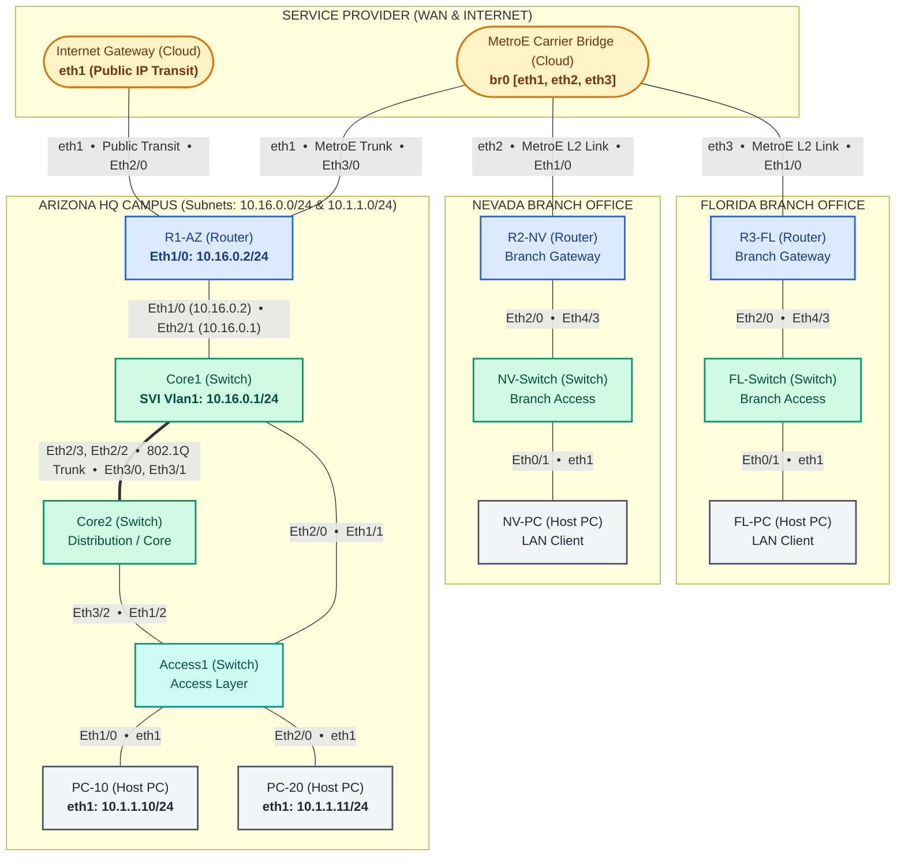

# Lab 01: Arizona - Nevada - Florida Multi-Site Enterprise Lab

An enterprise multi-site network topology based on CBT Nuggets CCNA/CCNP scenarios, simulating an Arizona Corporate HQ, Nevada and Florida branch offices, carrier Metro Ethernet WAN transit, and an Internet gateway.

---

## Topology Diagram


<details>
<summary><b>Click to view Mermaid Diagram code</b></summary>


</details>

---

## IP Addressing Table

| Device Name | Layer 3 Interface | IP Address |
| :--- | :--- | :--- |
| **Core1** | `Vlan1` | `10.16.0.1/24` |
| **R1-AZ** | `Ethernet1/0` | `10.16.0.2/24` |
| **PC-10** | `eth1` | `10.1.1.10/24` |
| **PC-20** | `eth1` | `10.1.1.11/24` |

---

## Lab Scenario & Exercise Overview

<!-- Exercise explanation placeholder: Add your brief explanation of the exercise below -->
> [!NOTE]
> **Exercise Summary:**
> *(Placeholder for exercise overview and scenario background. You can insert your lab description, topology requirements, and problem statements here).*

### Key Learning Tasks
* **Task 1: Base Configurations & Hostnames**
  * Set hostnames, disable domain lookup, configure synchronous console logging, and verify MOTD banners.
* **Task 2: Layer 2 Switching & Trunks**
  * Configure 802.1Q trunks between Core1, Core2, and Access1; set up EtherChannel and verify Spanning Tree Protocol (Rapid-PVST).
* **Task 3: IP Routing & Core Gateway**
  * Establish IP connectivity between Arizona Core SVI `10.16.0.1/24` and Router `10.16.0.2/24`.
* **Task 4: WAN & Branch Connectivity**
  * Configure routing across the Metro Ethernet WAN transit between Arizona, Nevada, and Florida.

---

## Quickstart Commands

```bash
# Navigate to this lab directory
cd Arizona-Nevada-Florida-lab

# Deploy the topology
containerlab deploy --topo ccna.clab.yml

# Check running status
containerlab inspect --topo ccna.clab.yml

# SSH into AZ Router (Credentials: admin / admin)
ssh admin@clab-ccna-R1-AZ

# Save CLI changes to configs/ and update ccna.clab.yml
python3 ../save_lab_configs.py ccna.clab.yml

# Destroy the lab
containerlab destroy --topo ccna.clab.yml --cleanup
```
