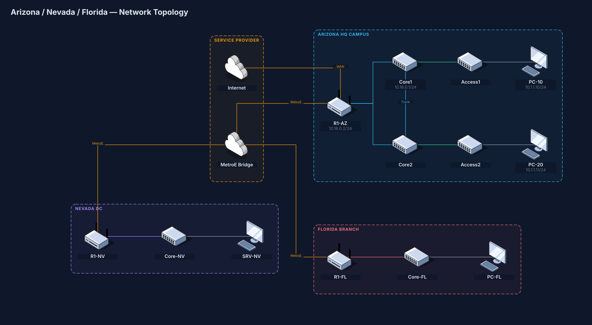
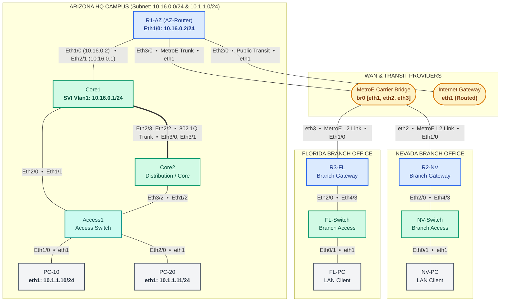

# Lab 01: Arizona - Nevada - Florida Multi-Site Enterprise Lab

An enterprise multi-site network topology based on CBT Nuggets CCNA/CCNP scenarios, simulating an Arizona Corporate HQ, Nevada and Florida branch offices, carrier Metro Ethernet WAN transit, and an Internet gateway.

---

## Topology Diagram



<details>
<summary><b>Click to view Mermaid Diagram code</b></summary>


</details>

---

## IP Addressing Table (Data Plane)

> [!NOTE]
> Out-of-band management interfaces (`Ethernet0/0` on `172.20.20.0/24`) are dedicated to Containerlab control/SSH and are omitted from this data plane table.

| Device Name | Role / Image | Interface | Assigned Data IP / Mask | Network / Subnet | Connected Node & Interface |
| :--- | :--- | :--- | :--- | :--- | :--- |
| **R1-AZ** (`AZ-Router`) | Cisco IOL L3 (`17.12.01`) | `Ethernet1/0`<br>`Ethernet3/0`<br>`Ethernet2/0` | `10.16.0.2/24`<br>*Unassigned (WAN L2)*<br>*Unassigned (Public)* | `10.16.0.0/24`<br>MetroE WAN<br>Internet Transit | `Core1:Ethernet2/1`<br>`MetroE:eth1`<br>`Internet:eth1` |
| **Core1** | Cisco IOL L2 (`L2-17.12.01`) | `Vlan1` (SVI)<br>`Ethernet2/1`<br>`Ethernet2/2`<br>`Ethernet2/3`<br>`Ethernet2/0` | `10.16.0.1/24`<br>Layer 2 (Routed link)<br>Layer 2 (Trunk)<br>Layer 2 (Trunk)<br>Layer 2 (Trunk) | `10.16.0.0/24`<br>HQ Core Link<br>Inter-Core Trunk<br>Inter-Core Trunk<br>Access Uplink | Management / Default Gateway<br>`R1-AZ:Ethernet1/0`<br>`Core2:Ethernet3/1`<br>`Core2:Ethernet3/0`<br>`Access1:Ethernet1/1` |
| **Core2** | Cisco IOL L2 (`L2-17.12.01`) | `Ethernet3/0`<br>`Ethernet3/1`<br>`Ethernet3/2` | Layer 2 (Trunk)<br>Layer 2 (Trunk)<br>Layer 2 (Trunk) | Inter-Core Trunk<br>Inter-Core Trunk<br>Access Uplink | `Core1:Ethernet2/3`<br>`Core1:Ethernet2/2`<br>`Access1:Ethernet1/2` |
| **Access1** | Cisco IOL L2 (`L2-17.12.01`) | `Ethernet1/1`<br>`Ethernet1/2`<br>`Ethernet1/0`<br>`Ethernet2/0` | Layer 2 (Uplink)<br>Layer 2 (Uplink)<br>Layer 2 (Access)<br>Layer 2 (Access) | Core1 Uplink<br>Core2 Uplink<br>VLAN 10 Data<br>VLAN 20 Data | `Core1:Ethernet2/0`<br>`Core2:Ethernet3/2`<br>`PC-10:eth1`<br>`PC-20:eth1` |
| **PC-10** | Alpine Linux Client | `eth1` | `10.1.1.10/24` | `10.1.1.0/24` | `Access1:Ethernet1/0` |
| **PC-20** | Alpine Linux Client | `eth1` | `10.1.1.11/24` | `10.1.1.0/24` | `Access1:Ethernet2/0` |
| **MetroE** | FRRouting (Carrier Bridge) | `br0` (`eth1`, `eth2`, `eth3`) | L2 Bridge | Carrier Transit | Bridges `R1-AZ:Eth3/0`, `R2-NV:Eth1/0`, `R3-FL:Eth1/0` |
| **Internet** | FRRouting (ISP Gateway) | `eth1` | Routed Transit | Public Internet | `R1-AZ:Ethernet2/0` |
| **R2-NV** | Cisco IOL L3 (`17.12.01`) | `Ethernet1/0`<br>`Ethernet2/0` | *WAN Interface*<br>*LAN Gateway* | MetroE WAN<br>Nevada Branch LAN | `MetroE:eth2`<br>`NV-Switch:Ethernet4/3` |
| **NV-Switch** | Cisco IOL L2 (`L2-17.12.01`) | `Ethernet4/3`<br>`Ethernet0/1` | Layer 2<br>Layer 2 (Access) | Branch Distribution<br>Branch LAN | `R2-NV:Ethernet2/0`<br>`NV-PC:eth1` |
| **NV-PC** | Alpine Linux Client | `eth1` | *DHCP / Dynamic* | Nevada Branch LAN | `NV-Switch:Ethernet0/1` |
| **R3-FL** | Cisco IOL L3 (`17.12.01`) | `Ethernet1/0`<br>`Ethernet2/0` | *WAN Interface*<br>*LAN Gateway* | MetroE WAN<br>Florida Branch LAN | `MetroE:eth3`<br>`FL-Switch:Ethernet4/3` |
| **FL-Switch** | Cisco IOL L2 (`L2-17.12.01`) | `Ethernet4/3`<br>`Ethernet0/1` | Layer 2<br>Layer 2 (Access) | Branch Distribution<br>Branch LAN | `R3-FL:Ethernet2/0`<br>`FL-PC:eth1` |
| **FL-PC** | Alpine Linux Client | `eth1` | *DHCP / Dynamic* | Florida Branch LAN | `FL-Switch:Ethernet0/1` |

---

## Lab Scenario & Exercise Overview

<!-- Exercise explanation placeholder: Add your brief explanation of the exercise below -->
> [!NOTE]
> **Exercise Summary:**
> *(Placeholder for exercise overview and scenario background. You can insert your lab description, topology requirements, and problem statements here).*

### Key Learning Tasks
* **Task 1: Base Configurations & Hostnames**
  * Set hostnames, disable domain lookup, configure synchronous console logging, and verify MOTD banners.
* **Task 2: Layer 2 Switching & Trunks**
  * Configure 802.1Q trunks between Core1, Core2, and Access1; set up EtherChannel and verify Spanning Tree Protocol (Rapid-PVST).
* **Task 3: IP Routing & Core Gateway**
  * Establish IP connectivity between Arizona Core SVI `10.16.0.1/24` and Router `10.16.0.2/24`.
* **Task 4: WAN & Branch Connectivity**
  * Configure routing across the Metro Ethernet WAN transit between Arizona, Nevada, and Florida.

---

## Quickstart Commands

```bash
# Navigate to this lab directory
cd Arizona-Nevada-Florida-lab

# Deploy the topology
containerlab deploy --topo ccna.clab.yml

# Check running status
containerlab inspect --topo ccna.clab.yml

# SSH into AZ Router (Credentials: admin / admin)
ssh admin@clab-ccna-R1-AZ

# Save CLI changes to configs/ and update ccna.clab.yml
python3 ../save_lab_configs.py ccna.clab.yml

# Destroy the lab
containerlab destroy --topo ccna.clab.yml --cleanup
```
