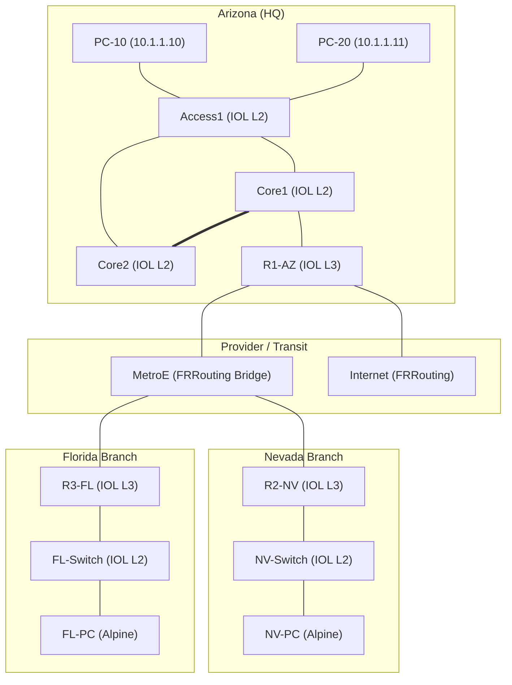

# Network Study Topologies (Containerlab)

This repository contains Containerlab (`clab`) network topologies and lab definitions used for CCNA, CCNP ENCOR, and CCNP ENARSI hands-on practice and network automation.

---

## Topologies

### 1. Arizona - Nevada - Florida Multi-Site Lab (`Arizona-Nevada-Florida-lab`)

A multi-site enterprise topology based on CBT Nuggets CCNA/CCNP scenarios, simulating enterprise HQ, branch offices, WAN transit (Metro Ethernet), and Internet gateway.

#### Architecture Overview


#### Node Breakdown
* **Routers (Cisco IOL L3 - `17.12.01`):** `R1-AZ`, `R2-NV`, `R3-FL`
* **Switches (Cisco IOL L2 - `L2-17.12.01`):** `Core1`, `Core2`, `Access1`, `NV-Switch`, `FL-Switch`
* **WAN / Transit (FRRouting):** `MetroE` (Layer 2 bridge across branches), `Internet`
* **End Hosts (Alpine Linux):** `PC-10`, `PC-20`, `NV-PC`, `FL-PC`

---

## Quickstart

### Prerequisites
* [Containerlab](https://containerlab.dev/) installed on Linux
* Docker installed and running
* Cisco IOL images loaded (`tkdebnath/cisco_iol:17.12.01` and `tkdebnath/cisco_iol:L2-17.12.01`)

### Deploying a Lab
```bash
cd Arizona-Nevada-Florida-lab
containerlab deploy --topo ccna.clab.yml
```

### Inspecting Running Nodes
```bash
containerlab inspect --topo ccna.clab.yml
```

### Connecting to Devices
```bash
# SSH into Cisco IOL node (default credentials: admin / admin)
ssh admin@clab-ccna-R1-AZ

# Or attach via docker exec
docker exec -it clab-ccna-R1-AZ Cli
```

### Destroying the Lab
```bash
containerlab destroy --topo ccna.clab.yml --cleanup
```

### Configuration Persistence & Automated Sync
Device configurations are stored in `configs/*.cfg` and automatically loaded on deployment.

#### Automate Config Extraction with Python
Whenever you make dynamic changes on routers/switches via the CLI, run the included Python utility:
```bash
./save_lab_configs.py
# or specify the topology file:
./save_lab_configs.py Arizona-Nevada-Florida-lab/ccna.clab.yml
```

This script will automatically:
1. Connect to all live nodes via SSH.
2. Issue `write memory` on each device.
3. Extract the clean running-config to `configs/<node_name>.cfg`.
4. Update the `.clab.yml` topology file so it points to the newly saved configs.

Once finished, simply commit to Git:
```bash
git add .
git commit -m "feat(configs): updated dynamic CLI configurations"
```
